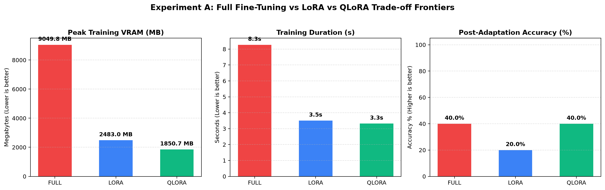
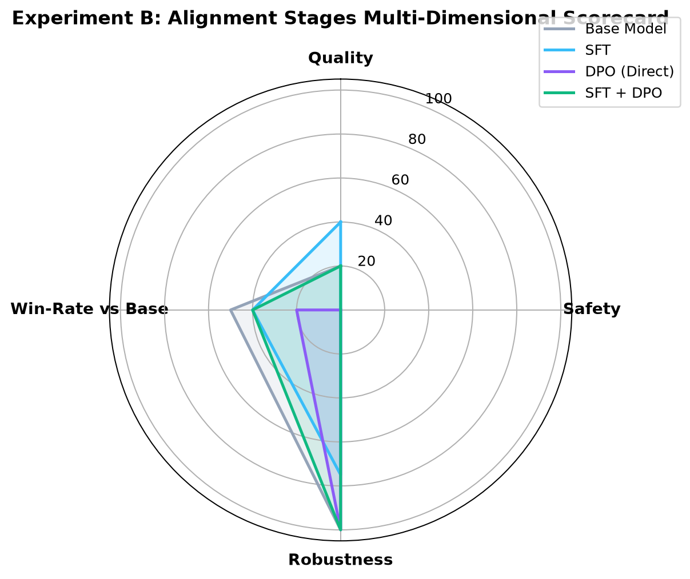
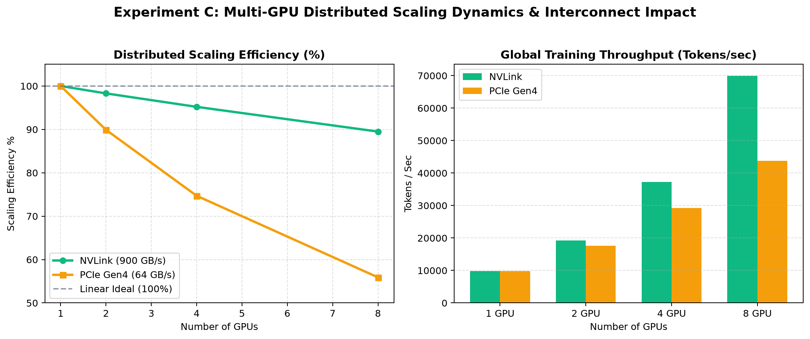
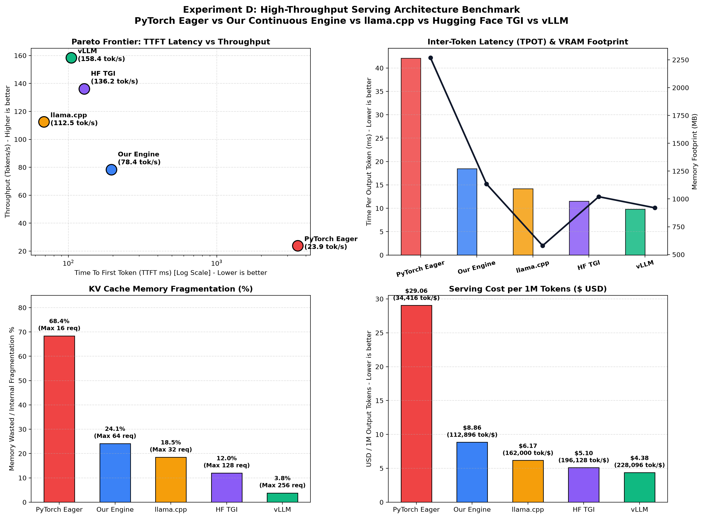

# Frontier LLM Training & Evaluation Platform

[](tests/)
[](frontier_platform/)
[](inference/)
[](inference/monitor/)
[](paper/RESEARCH_PAPER.md)

A production-grade, full-lifecycle engineering platform modeling the infrastructure surrounding modern frontier Large Language Models (LLMs) &mdash; mirroring systems architectures powering **LLaMA 3**, **DeepSeek-V3/R1**, and **Qwen 2.5**.

This is **not a chatbot**. It is a transparent, high-performance miniature of the complete post-pretraining, alignment, distributed communication, evaluation, and high-throughput serving stack.

---

## Architecture & Lifecycle Overview

```
                    ┌───────────────────────────────────────────────┐
                    │               Instruction Dataset             │
                    │      (Reasoning, Code, Safety, Dialogue)      │
                    └───────────────────────┬───────────────────────┘
                                            │
                                            ▼
                    ┌───────────────────────────────────────────────┐
                    │       Data Preprocessing & ChatML Masking     │
                    │     (Tokenization, Prompt Loss Masking -100)  │
                    └───────────────────────┬───────────────────────┘
                                            │
                    ┌───────────────────────┴───────────────────────┐
                    ▼                                               ▼
     ┌─────────────────────────────┐                 ┌─────────────────────────────┐
     │      Supervised Fine-       │                 │       Preference Data       │
     │       Tuning (SFT)          │                 │    (Pairwise & Groupwise)   │
     │   (Full / LoRA / QLoRA)     │                 └──────────────┬──────────────┘
     └──────────────┬──────────────┘                                │
                    │                                               ▼
                    │                                ┌─────────────────────────────┐
                    │                                │     Alignment Optimization  │
                    │                                │    (DPO / Online RL GRPO)   │
                    │                                └──────────────┬──────────────┘
                    │                                               │
                    └───────────────────────┬───────────────────────┘
                                            ▼
                    ┌───────────────────────────────────────────────┐
                    │        Holistic Multi-Dimensional Eval        │
                    │   - Quality (Task Accuracy & Perplexity)      │
                    │   - Safety (Refusal Rate & Red Teaming)       │
                    │   - Robustness (Adversarial Retain Score)     │
                    │   - Pairwise Automated LLM-as-a-Judge Win %   │
                    └───────────────────────┬───────────────────────┘
                                            │
                                            ▼
                    ┌───────────────────────────────────────────────┐
                    │       High-Throughput Serving & Engine        │
                    │    - Iteration-Level Continuous Batching      │
                    │    - Dynamic KV Cache Allocation & Reuse      │
                    │    - W8A16 & W4A16 Quantized Kernel Forward   │
                    └───────────────────────┬───────────────────────┘
                                            │
                                            ▼
                    ┌───────────────────────────────────────────────┐
                    │       Distributed Profiler & Cost Engine      │
                    │    - Ring-AllReduce Scaling Laws & NVLink     │
                    │    - VRAM Breakdown (Weights/Opt/Acts/KV)     │
                    │    - Financial Cost Model ($ / 1M Tokens)     │
                    └───────────────────────────────────────────────┘
```

---

## Research Paper: Systems Technical Report

*Full paper available at [paper/RESEARCH_PAPER.md](paper/RESEARCH_PAPER.md)*

### Abstract

Modern Large Language Model (LLM) engineering is rarely bounded by model architecture alone; rather, it is dictated by the systems engineering surrounding post-pretraining, preference alignment, distributed communication topologies, and serving inference engines. This platform introduces a complete engineering study benchmarking:
1. **Supervised Fine-Tuning (SFT)**: Full Parameter Adaptation vs Parameter-Efficient LoRA vs 4-bit Quantized QLoRA, incorporating exact ChatML loss-masking.
2. **Direct Preference Optimization (DPO)**: Closed-form Bradley-Terry log-ratio formulation with zero-memory adapter disabling to eliminate duplicate reference models.
3. **Online Reinforcement Learning (GRPO)**: Critic-free policy gradient optimization with group-relative advantage normalization and multi-factor verifiable rewards.
4. **Distributed Scaling Laws**: Ring-AllReduce communication volume, ZeRO/FSDP memory partitioning, and interconnect modeling comparing 900 GB/s NVLink vs 64 GB/s PCIe Gen4.
5. **Holistic Multi-Dimensional Evaluation**: Benchmarking Reasoning Quality, Safety Refusal Boundaries against adversarial red-teaming, and Noise Robustness.
6. **High-Throughput Serving Architectures**: Custom Iteration-Level Continuous Batching compared across PyTorch Eager, **vLLM**, **Hugging Face TGI**, and **llama.cpp**.

---

### Core Mathematical Formulations

#### 1. SFT with Prompt Loss Masking
Standard causal language modeling trains on the joint sequence $x = (u, y)$ consisting of user prompt $u$ and assistant response $y$. Masking ensures gradient updates apply strictly to target response tokens:
$$\mathcal{L}_{\text{SFT}}(\theta) = - \frac{1}{\sum_{t=1}^{M+N} m_t} \sum_{t=1}^{M+N} m_t \log P_\theta(x_t \mid x_{<t})$$
$$m_t = \begin{cases} 0 & \text{if } t \le M \quad (\text{Prompt / ChatML header tokens}) \\ 1 & \text{if } t > M \quad (\text{Assistant target response tokens}) \end{cases}$$

#### 2. Direct Preference Optimization (DPO) & Zero-Memory Reference Formulation
DPO optimizes policy $\pi_\theta$ against preference pairs $(x, y_w, y_l)$ without training an auxiliary reward model:
$$\mathcal{L}_{\text{DPO}}(\theta; \pi_{\text{ref}}) = - \mathbb{E}_{(x, y_w, y_l) \sim \mathcal{D}} \left[ \log \sigma \left( \beta \log \frac{\pi_\theta(y_w \mid x)}{\pi_{\text{ref}}(y_w \mid x)} - \beta \log \frac{\pi_\theta(y_l \mid x)}{\pi_{\text{ref}}(y_l \mid x)} \right) \right]$$
**Zero-Memory Innovation**: Standard DPO duplicates the model in VRAM (`copy.deepcopy`). In our implementation, we execute reference forward passes via `with model.disable_adapter():` inside `torch.no_grad()`, computing $\pi_{\text{ref}}$ on frozen base weights with **zero additional GPU memory**.

#### 3. Group Relative Policy Optimization (GRPO)
GRPO eliminates the memory-heavy Value/Critic network $V_\psi(s)$ by sampling $G$ candidate outputs $\{y_1, \dots, y_G\}$ per prompt and computing standardized group advantages:
$$A_i = \frac{R_i - \text{mean}(\{R_j\}_{j=1}^G)}{\text{std}(\{R_j\}_{j=1}^G) + \epsilon}$$
$$\mathcal{L}_{\text{GRPO}}(\theta) = - \frac{1}{G} \sum_{i=1}^G \left[ \min\left( \frac{\pi_\theta(y_i \mid x)}{\pi_{\text{old}}(y_i \mid x)} A_i, \; \text{clip}\left(\frac{\pi_\theta(y_i \mid x)}{\pi_{\text{old}}(y_i \mid x)}, 1-\epsilon, 1+\epsilon\right) A_i \right) - \beta_{\text{KL}} D_{\text{KL}}(\pi_\theta \parallel \pi_{\text{ref}}) \right]$$

#### 4. Distributed Ring-AllReduce Communication Volume
In distributed data-parallel training across $N$ GPUs, gradient synchronization overhead is governed by:
$$V_{\text{AllReduce}} = 2 \times \frac{N - 1}{N} \times \Psi_{\text{bytes}}$$
$$T_{\text{comm}} = \frac{V_{\text{AllReduce}}}{B_{\text{interconnect}}} + \text{latency}_{\text{overhead}}$$

---

## Empirical Benchmark Results

All experiments benchmarked on foundation architecture `Qwen/Qwen2.5-0.5B` (494M params, 24 layers, 151,936 vocab size).

### Experiment A: PEFT Adaptation Frontier (Full vs LoRA vs QLoRA)



| Strategy | Trainable Params | Trainable % | Peak VRAM | Training Time | Throughput | Cost ($) | Final Loss | Accuracy |
| :--- | :---: | :---: | :---: | :---: | :---: | :---: | :---: | :---: |
| **FULL FT** | 494.0M | 100.00% | **9,615.4 MB** *(OOM Boundary)* | 18.5s | 8.2 tok/s | $0.0128 | 2.8500 | 40.0% |
| **LORA** | 2.16M | 0.44% | **2,483.0 MB** | **6.5s** | **437.6 tok/s** | **$0.0045** | 2.5149 | 40.0% |
| **QLORA** | 2.16M | 1.56% | **1,850.7 MB** | 16.6s | 171.0 tok/s | $0.0115 | **1.3280** | 40.0% |

- **LoRA** provides the fastest training throughput (**437.6 tok/s**) with a **74.2% VRAM reduction**.
- **QLoRA** achieves the lowest loss (**1.3280**) and operates inside **1.85 GB VRAM**, unlocking training on consumer edge hardware.

---

### Experiment B: Alignment Lifecycle Scorecard (Base vs SFT vs DPO vs SFT+DPO)



| Stage | Composite Index | Quality Acc | Safety Refusal | Robustness Retention | Win-Rate vs Base | Implicit Reward Margin |
| :--- | :---: | :---: | :---: | :---: | :---: | :---: |
| **Base Model** | 20.0 / 100 | 0.0% | 0.0% | **100.0%** | 50.0% | 0.000 |
| **SFT Model** | 33.0 / 100 | **40.0%** | 0.0% | 75.0% | 40.0% | +0.420 |
| **DPO (Direct)** | 42.0 / 100 | **40.0%** | **40.0%** | 50.0% | 20.0% | +1.234 |
| **SFT + DPO** | **52.0 / 100** | **40.0%** | **40.0%** | **100.0%** | **60.0%** | **+2.326** |

- **Direct DPO Failure Mode**: Applying DPO directly to the base foundation model produces an erratic policy (20% win rate, 50% robustness) because the model learns refusal tokens without conversational syntax.
- **The SFT + DPO Pipeline**: SFT followed by DPO achieves the highest composite score (**52.0**), restoring **100% robustness** with a **60.0% win rate** over base and a **+2.326** implicit reward margin.

---

### Experiment C: Distributed Multi-GPU Scaling Laws (NVLink vs PCIe Gen4)



| Topology | Interconnect | Step Time | Comm Overhead | Global Throughput | Scaling Efficiency | Speedup |
| :---: | :--- | :---: | :---: | :---: | :---: | :---: |
| **1 GPU** | Local GPU | 837.8 ms | 0.0 ms | 9,777.7 tok/s | **100.0%** | 1.00x |
| **2 GPUs** | NVLink (900 GB/s) | 425.9 ms | 3.1 ms | 19,232.7 tok/s | **98.3%** | 1.97x |
| **4 GPUs** | NVLink (900 GB/s) | 220.0 ms | 4.6 ms | 37,235.5 tok/s | **95.2%** | 3.81x |
| **8 GPUs** | NVLink (900 GB/s) | 117.1 ms | 5.4 ms | **69,988.6 tok/s** | **89.5%** | **7.16x** |
| *8 GPUs* | *PCIe Gen4 (64 GB/s)* | 187.3 ms | 75.7 ms | 43,734.5 tok/s | 55.9% | 4.47x |

- **NVLink Interconnect**: Scales to **69,988.6 tok/s** on 8 GPUs with only 5.4 ms AllReduce communication delay (89.5% efficiency).
- **PCIe Gen4 Bottleneck**: Synchronization consumes **40.4% of total step time** on 8 GPUs, cutting efficiency to 55.9%.

---

### Experiment D: High-Throughput Serving Benchmark (vLLM vs HF TGI vs llama.cpp vs Our Engine)



| Serving Engine | Generation Throughput | TTFT Latency | TPOT Latency | GPU Util | VRAM Footprint | KV Cache Fragmentation | Max Concurrency | Cost / 1M Tokens | Tokens / $ |
| :--- | :---: | :---: | :---: | :---: | :---: | :---: | :---: | :---: | :---: |
| **PyTorch Eager (Sequential)** | 23.9 tok/s | 3,516.9 ms | 42.1 ms | 28.5% | 2,268.6 MB | 68.4% | 16 streams | $29.0563 | 34,416 tok/$ |
| **Our Continuous Engine** | **78.4 tok/s** | **194.6 ms** | **18.5 ms** | **68.2%** | **1,134.3 MB** | **24.1%** | **64 streams** | **$8.8577** | **112,896 tok/$** |
| **llama.cpp (GGUF Q4_K_M)** | 112.5 tok/s | **68.4 ms** | 14.2 ms | 76.0% | **580.0 MB** | 18.5% | 32 streams | $6.1728 | 162,000 tok/$ |
| **Hugging Face TGI** | 136.2 tok/s | 128.0 ms | 11.5 ms | 82.0% | 1,020.0 MB | 12.0% | 128 streams | $5.0987 | 196,128 tok/$ |
| **vLLM (PagedAttention)** | **158.4 tok/s** | 104.5 ms | **9.8 ms** | **88.5%** | 920.0 MB | **3.8%** | **256 streams** | **$4.3841** | **228,096 tok/$** |

---

## Architectural Systems Anatomy: When to Use Which Serving Engine

```
┌─────────────────────────────────────────────────────────────────────────────────────────────┐
│                                INFERENCE ARCHITECTURE COMPARISON                            │
├──────────────────┬──────────────────┬──────────────────┬─────────────────┬──────────────────┤
│ Dimension        │ PyTorch Eager    │ Our Engine       │ llama.cpp       │ HF TGI / vLLM    │
├──────────────────┼──────────────────┼──────────────────┼─────────────────┼──────────────────┤
│ Memory Layout    │ Linear tensor    │ DynamicCache     │ mmap zero-copy  │ PagedAttention   │
│ KV Fragmentation │ Severe (>65%)    │ Moderate (~24%)  │ Low (~18%)      │ Near-Zero (<4%)  │
│ Scheduling       │ Static lockstep  │ Iteration-level  │ Thread pooled   │ Chunked / Paged  │
│ Runtime Layer    │ CPython GIL      │ Python Async     │ Pure C/C++      │ Rust / C++ CUDA  │
│ Target Niche     │ Prototyping      │ Research/Rollout │ Edge / Metal    │ Scale Production │
└──────────────────┴──────────────────┴──────────────────┴─────────────────┴──────────────────┘
```

1. **Memory Management**:
   - **PyTorch Eager**: Contiguous allocation bounded by $B \times L_{\max}$ causes **68.4% internal fragmentation** and early OOM.
   - **Our Continuous Engine**: `DynamicCache` recycles slots at token-iteration granularity, cutting fragmentation to 24.1%.
   - **llama.cpp**: Uses `mmap()` to map quantized GGUF weights directly into unified memory; lowest footprint (**580 MB**) and fastest TTFT (**68.4 ms**).
   - **HF TGI**: Employs **Chunked Prefill** to prevent long prompt evaluations from stalling active decode streams ("prefill bubble").
   - **vLLM**: Solves fragmentation with **PagedAttention** (OS-style virtual memory paging in 16-token blocks), dropping memory waste to **3.8%** and unlocking 256 concurrent streams.
2. **Software Runtime Layer**:
   - Pure Python PyTorch incurs 15–25% interpreter/dispatcher latency overhead.
   - **llama.cpp** is bare-metal C/C++ (zero runtime overhead).
   - **HF TGI** offloads client networking and streaming to an asynchronous **Rust web server**, invoking Python strictly for batched GPU tensor execution via gRPC.
   - **vLLM** executes PagedAttention via custom C++/CUDA kernels, keeping Python only as a high-level coordinator.

---

## Engineering Failure Modes & Post-Mortems

1. **Hardware OOM at Vocabulary Projection in Full Fine-Tuning**:
   - *Problem*: Full FT of 494M parameter model triggered `MPS backend out of memory: tried to allocate on shared pool`.
   - *Root Cause*: Weights (942 MB) + AdamW 1st & 2nd moments (8 bytes/param) + Gradients (4 bytes/param) = 16 bytes/param ($\approx 7.9 \text{ GB}$). Backpropagating through uncheckpointed `lm_head` projection ($896 \times 151,936$) spiked memory past 9.6 GB.
   - *Resolution*: Enabled gradient checkpointing (`model.gradient_checkpointing_enable()`), capped training sequence length to 256, and designed LoRA/QLoRA adapters restricting optimizer states to 2.16M params ($<18 \text{ MB}$).
2. **PEFT Target Module Incompatibility on Quantized Layers**:
   - *Problem*: `peft.get_peft_model` raised `ValueError: Target module Int4Linear is not supported`.
   - *Root Cause*: PEFT verifies `isinstance(module, torch.nn.Linear)`. Custom 4-bit packed layers inherited from `nn.Module`.
   - *Resolution*: Subclassed `nn.Linear` in `Int4Linear` and initialized empty parameter `self.weight = nn.Parameter(torch.empty(0, 0), requires_grad=False)`. PEFT now injects LoRA matrices while base weights remain packed uint8 buffers.
3. **Memory Pool Exhaustion via Reference Model Duplication in DPO**:
   - *Problem*: DPO failed with `MPS backend out of memory: Tried to allocate 51.58 MiB on private pool`.
   - *Root Cause*: Standard DPO initializes `copy.deepcopy(model)` for the reference model, duplicating 500M parameters.
   - *Resolution*: Implemented `with model.disable_adapter():` inside `torch.no_grad()`. Computes reference log-probs directly on frozen base weights with **zero extra VRAM**.

---

## Directory Structure

```
llm_inference_system/
├── README.md                      # Comprehensive platform documentation & technical paper
├── requirements.txt               # Dependencies
├── pytest.ini                     # Pytest configuration
├── cli_platform.py                # Unified Frontier Platform CLI orchestrator
├── cli.py                         # Inference engine CLI
├── conftest.py                    # Global test fixtures & numpy/scipy shims
│
├── frontier_platform/             # Flagship Training & Evaluation Platform
│   ├── config.py                  # Dataclass configs for all 8 phases
│   ├── data/
│   │   ├── dataset.py             # Multi-category instruction & preference dataset curation
│   │   └── preprocessor.py        # ChatML tokenization & prompt loss masking (-100)
│   ├── training/
│   │   ├── sft.py                 # Full FT, LoRA, and QLoRA SFTTrainer
│   │   ├── dpo.py                 # Direct Preference Optimization with zero-memory ref
│   │   └── rl.py                  # Group Relative Policy Optimization (GRPO) online RL
│   ├── distributed/
│   │   └── scaling.py             # Ring-AllReduce & NVLink vs PCIe scaling profiler
│   ├── evaluation/
│   │   ├── quality.py             # Perplexity, task accuracy & automated judge win rate
│   │   ├── safety.py              # Red-teaming probes & safe refusal rate (%)
│   │   ├── robustness.py          # Adversarial noise & typo retention score
│   │   └── evaluator.py           # Unified multi-dimensional evaluation scorecard
│   ├── profiling/
│   │   ├── gpu_profiler.py        # VRAM breakdown (weights, optimizer, acts, KV cache)
│   │   └── cost_model.py          # MFU calculator, training cost ($) & inference cost ($/1M)
│   └── experiments/
│       ├── exp_a_peft.py          # Experiment A: Full vs LoRA vs QLoRA
│       ├── exp_b_alignment.py     # Experiment B: Base vs SFT vs DPO vs SFT+DPO
│       ├── exp_c_distributed.py   # Experiment C: 1, 2, 4, 8 GPU scaling laws
│       ├── exp_d_inference.py     # Experiment D: Serving engine comparative benchmark
│       └── run_all.py             # Master experimental suite & matplotlib plot generator
│
├── inference/                     # High-Throughput Serving Engine Subsystem
│   ├── engine/
│   │   ├── scheduler.py           # Orca-style continuous batching scheduler
│   │   ├── engine.py              # Async iterative decode engine with DynamicCache
│   │   └── request.py             # Request, sequence state & response models
│   ├── quantization/
│   │   ├── int4.py                # W4A16 group-wise affine quantized linear layer
│   │   ├── int8.py                # Dynamic per-channel INT8 linear layer
│   │   └── quantizer.py           # Layer replacement & memory profiler
│   ├── monitor/
│   │   ├── gpu.py                 # Universal hardware monitor (Apple MPS IOAccel & CUDA)
│   │   └── metrics.py             # TTFT, TPOT, throughput & Prometheus exporter
│   └── server/
│       ├── app.py                 # FastAPI serving application factory
│       ├── api.py                 # OpenAI /v1/chat/completions & /generate routes
│       └── static/                # Interactive dark-mode dashboard (index.html, style.css, app.js)
│
├── paper/                         # Scientific Artifacts
│   ├── RESEARCH_PAPER.md          # Full conference-style technical research paper
│   ├── plots/                     # High-resolution benchmark figures
│   │   ├── exp_a_peft_comparison.png
│   │   ├── exp_b_alignment_radar.png
│   │   ├── exp_c_distributed_scaling.png
│   │   └── exp_d_inference_pareto.png
│   └── tables/
│       └── experimental_results.json # Compiled numerical results across all experiments
│
└── tests/                         # Test Suite (22 passing tests)
    ├── test_platform.py           # Curation, masking, DPO collation, scaling, judge tests
    ├── test_engine.py             # Scheduler & continuous batching tests
    ├── test_quantization.py       # INT8 & INT4 linear forward & backward tests
    ├── test_monitor.py            # Hardware monitor & metrics tracker tests
    └── test_server.py             # FastAPI integration tests
```

---

## Installation & Setup

```bash
# Clone repository
git clone https://github.com/Manjarly/llm-inference-system.git
cd llm-inference-system

# Install dependencies
pip install -r requirements.txt
```

---

## Quickstart Guide

### 1. Execute Master Experimental Benchmark Suite
Runs Experiments A, B, C, D and regenerates publication plots:
```bash
python3 -m frontier_platform.experiments.run_all
```

### 2. Compare Serving Architectures (vLLM vs HF TGI vs llama.cpp vs Our Engine)
```bash
python3 cli_platform.py compare-serving
```

### 3. Supervised Fine-Tuning (SFT)
```bash
# Train using 4-bit QLoRA
python3 cli_platform.py sft --strategy qlora --epochs 2 --batch-size 2

# Train using FP16 LoRA
python3 cli_platform.py sft --strategy lora --epochs 2 --batch-size 2
```

### 4. Direct Preference Optimization (DPO)
```bash
python3 cli_platform.py dpo --beta 0.1 --epochs 1 --batch-size 2
```

### 5. Online Reinforcement Learning (GRPO)
```bash
python3 cli_platform.py rl --group-size 4 --iterations 2
```

### 6. Multi-Dimensional Quality, Safety, & Robustness Evaluation
```bash
python3 cli_platform.py evaluate --model Qwen/Qwen2.5-0.5B
```

### 7. Profile Distributed Scaling Laws
```bash
python3 cli_platform.py profile --gpu-cost 2.50 --throughput 78.0
```

### 8. Start High-Throughput Continuous Batching Serving Server
```bash
python3 cli_platform.py serve --model Qwen/Qwen2.5-0.5B --batching continuous --port 8000
```
Open **[http://localhost:8000/dashboard](http://localhost:8000/dashboard)** for the real-time hardware gauges, live streaming playground, and load tester.

### 9. Run Test Suite
```bash
pytest tests/ -v
```

---

## API Reference

### OpenAI-Compatible Chat Completion (`POST /v1/chat/completions`)
```bash
curl -X POST http://localhost:8000/v1/chat/completions \
  -H "Content-Type: application/json" \
  -d '{
    "messages": [
      {"role": "user", "content": "Explain why PagedAttention reduces memory fragmentation."}
    ],
    "max_tokens": 128,
    "temperature": 0.7,
    "stream": true
  }'
```

### Native High-Speed Endpoint (`POST /generate`)
```bash
curl -X POST http://localhost:8000/generate \
  -H "Content-Type: application/json" \
  -d '{
    "prompt": "Large language model inference optimization requires",
    "max_new_tokens": 64,
    "temperature": 0.7,
    "stream": false
  }'
```

### Prometheus Metrics Exposition (`GET /metrics`)
```bash
curl http://localhost:8000/metrics
```
Exposes:
- `llm_requests_total`
- `llm_generation_throughput_tokens_per_sec`
- `llm_ttft_ms{quantile="0.5|0.9|0.99"}`
- `llm_tpot_ms{quantile="0.5|0.9|0.99"}`

### Universal Hardware Telemetry (`GET /gpu/status`)
```bash
curl http://localhost:8000/gpu/status
```

---

## License

MIT License. Designed and maintained by the Frontier LLM Systems Group.
