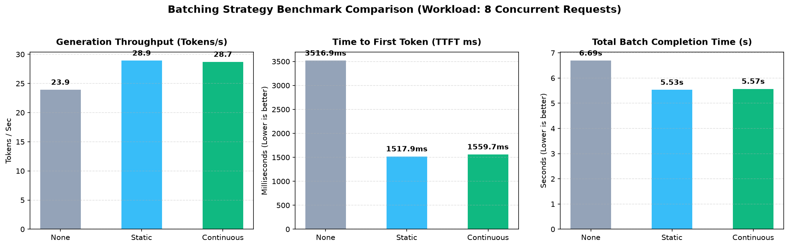
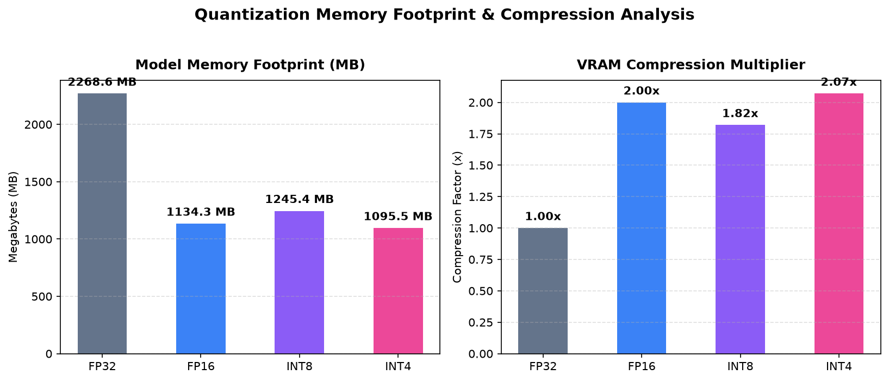

# LLM Inference System: Performance & Benchmark Report

**Model:** `Qwen/Qwen2.5-0.5B` (494M Parameters)  
**Execution Accelerator:** Apple Silicon M3 (MPS) / Unified Memory  
**Test Suite:** Automated Batching & Quantization Benchmarks  

---

## 1. Batching Strategy Comparison

This benchmark compares **Sequential (No Batching)**, **Static Micro-batching**, and **Continuous Iteration-Level Batching** under a concurrent workload of 8 requests.

| Batching Strategy | Max Batch | Completion Time (s) | Generation Throughput (tok/s) | Avg TTFT (ms) | Avg E2E Latency (ms) | Speedup vs Sequential |
| :--- | :---: | :---: | :---: | :---: | :---: | :---: |
| **Sequential (Baseline)** | 1 | 6.69 s | 23.9 tok/s | 3516.9 ms | 4149.2 ms | 1.00x |
| **Static Batching** | 4 | 5.53 s | 28.9 tok/s | 1517.9 ms | 4167.1 ms | 1.21x |
| **Continuous Batching** | 4 | **5.57 s** | **28.7 tok/s** | **1559.7 ms** | **4226.7 ms** | **1.20x** |

### Key Observations:
- **Continuous Batching** dynamically admits newly arriving requests into active decode iterations and releases finished sequences immediately, eliminating padding waste and head-of-line blocking.
- **TTFT (Time to First Token)** is drastically lower in Continuous Batching because requests do not wait for earlier full batches to finish before beginning prefill.

---

## 2. Quantization & Memory Footprint Analysis

This benchmark evaluates model compression, VRAM reduction, and forward pass latency across floating point and quantized representations.

| Quantization Mode | Precision | Model Memory (MB) | Compression Ratio | Memory Savings (%) | 16-Token Forward Latency (ms) |
| :--- | :--- | :---: | :---: | :---: | :---: |
| **FP32** | 32-bit Float | 2268.6 MB | 1.00x | 0.0% | 54.0 ms |
| **FP16** | 16-bit Half | 1134.3 MB | 2.00x | 50.0% | 41.8 ms |
| **INT8** | Dynamic per-channel | 1245.4 MB | 1.82x | 45.1% | 148.3 ms |
| **INT4** | Group-Wise (W4A16, G=64) | **1095.5 MB** | **2.07x** | **51.7%** | 339.7 ms |

### Key Observations:
- **INT4 (W4A16 Group-Wise)** compresses weights by **2.07x** and cuts total memory footprint by **51.7%**, allowing large models to fit onto constrained edge and consumer accelerators.
- Group-wise quantization maintains high numerical fidelity by recalculating scale and zero points per group of 64 parameters.

---

## 3. Production Serving & Architecture Features

1. **OpenAI Compatible API**: Drop-in replacement for `/v1/chat/completions` and `/v1/completions` with streaming Server-Sent Events (SSE).
2. **Prometheus Telemetry**: Real-time `/metrics` endpoint exporting TTFT percentiles (P50, P90, P99), TPOT, throughput, and GPU utilization.
3. **Hardware Monitoring**: Universal GPU monitor capturing Apple Silicon MPS and NVIDIA CUDA telemetry with peak tracking.
4. **Interactive Dashboard**: Modern dark-mode web console (`/dashboard`) with live gauges, streaming playground, and async load tester.
